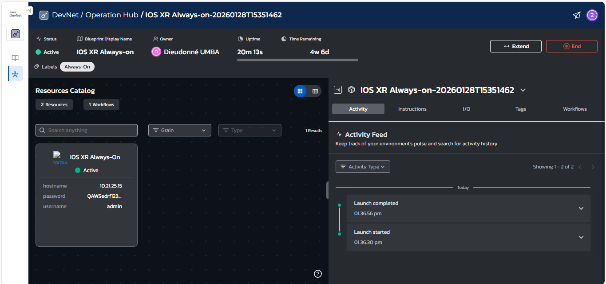
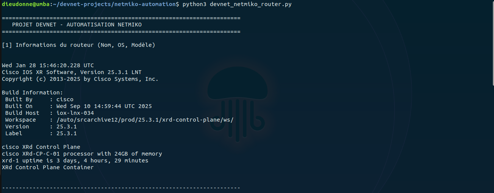
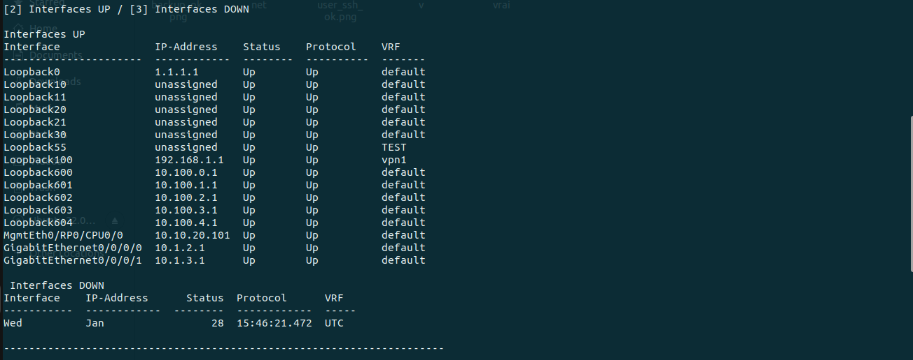
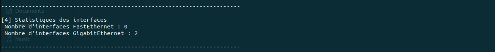
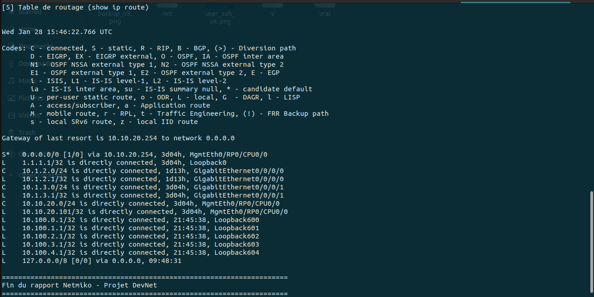

# Projet DevNet – Automatisation réseau avec Netmiko

## 👤 Auteurs
* **Travail réalisé par** : Dieudonné UMBA  et Sharon-rose MUKUNDI 
* **Filière** : DevOps et Sécurité informatique
* **Promotion** : Master 2
* **Année académique** : 2025 – 2026
  
## Description
Ce projet DevNet consiste à développer un programme en **Python** permettant de se connecter à un **routeur Cisco** via **SSH**, en utilisant la librairie **Netmiko**, afin d’exécuter des commandes réseau et d’afficher automatiquement des informations importantes sur le routeur.

Le projet est réalisé dans un cadre **académique et pédagogique**, pour introduire les concepts de base de l’**automatisation réseau** et du **NetDevOps**.

## 🧰 Technologies utilisées
- **Python 3**
- **Netmiko**
- **Tabulate**
- **Cisco IOS XR**
- **SSH**

## 🖧 Environnement réseau
- Équipement : Routeur Cisco
- Système : IOS XR
- Accès : Cisco DevNet Sandbox
- Méthode de connexion : SSH
  
  
---
## 📂 Structure du projet
```text
Netmiko-Project/
│
├── devnet_netmiko_router.py   # Script Python principal (Netmiko)
├── screenshots/              # Captures d’écran des résultats d’exécution
│   └── *.png
├── README.md                 # Documentation du projet
```

## Test (résultats obtenus)
Le programme permet de :

**1.** Afficher le **nom du routeur**, la **version du système d’exploitation (OS)** et le **modèle du routeur**  
Commandes utilisées :  
   - `show running-config`  
* **Résultat**
  
 
---

**2.** Afficher la **liste des interfaces actives (UP)**  
Commande : `show ip interface brief`
* **Résultat**
  
 
---

**3.** Afficher la **liste des interfaces inactives (DOWN)**  
Commande : `show ip interface brief`
* **Résultat** : Il n’y a aucune interface en état down, donc toutes les interfaces sont UP sur ce routeur. 
  

---

**4.** Afficher le **nombre d’interfaces FastEthernet** et **GigabitEthernet**  
Commande : `show ip interface brief`
* **Résultat**
  
 
---

**5.** Afficher la **liste des réseaux accessibles via le routeur**  
Commande : `show ip route`
* **Résultat**
  
 
---
## Conclusion

Ce projet DevNet a permis de mettre en œuvre l’automatisation réseau à l’aide de Python et de la librairie Netmiko, en automatisant l’exécution de commandes sur un routeur Cisco via SSH. Le programme développé facilite la collecte d’informations essentielles telles que l’état et les statistiques des interfaces, les caractéristiques du routeur et la table de routage.

Ce travail a renforcé les compétences en programmation Python, en administration réseau Cisco et en DevNet, tout en mettant en évidence l’intérêt de l’automatisation pour améliorer l’efficacité et la fiabilité de la gestion des infrastructures réseau. Il constitue une base solide pour des projets d’automatisation plus avancés.


